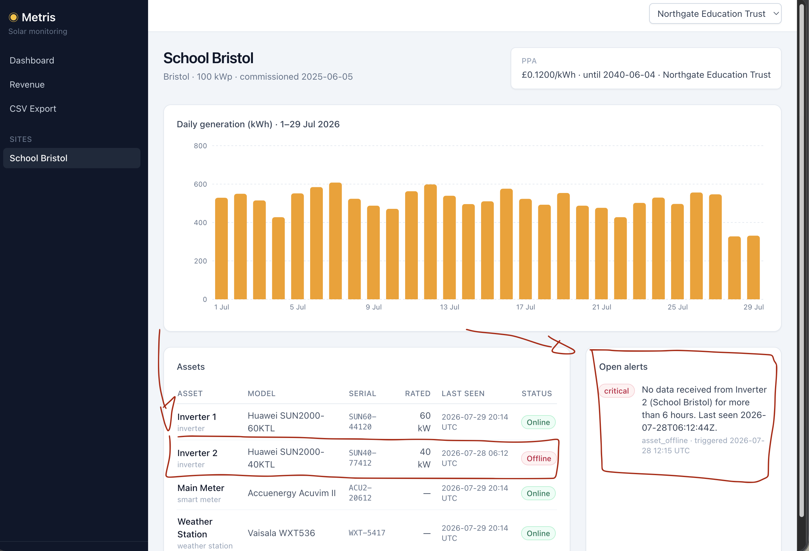

# TICKET-4830 · Generation dropped ~40% at School Bristol

|                 |                                                                                                                                     |
| --------------- | ----------------------------------------------------------------------------------------------------------------------------------- |
| Ticket          | [TICKET-4830](../tickets/TICKET-4830-generation-drop-school-bristol.md)                                                             |
| Customer        | Northgate Education Trust (reported by Tom Whitfield)                                                                               |
| Reported        | 2026-07-29 08:10 UTC                                                                                                                |
| Severity        | High — the site's only PV asset pair is down to one, and revenue with it                                                            |
| Status          | **Diagnosed** · remediation is a field intervention, not a code change                                                              |
| Change          | None — no code ships with this report; the remediation is a field check on the inverter, and the platform-side items are follow-ups |
| Root cause in   | **Hardware / connectivity** — contact with Inverter 2 was lost                                                                      |
| Contributing    | **Product** — the console never ties the outage to the generation figure                                                            |
| Affects         | School Bristol only, from 2026-07-28                                                                                                |
| Investigated by | Guilherme Duarte Giesbrecht                                                                                                         |
| Report date     | 2026-09-13 · last updated 2026-09-14                                                                                                |

---

## Summary

School Bristol runs two inverters. **Inverter 2 accounts for 39.88% of the
site's generation.** Contact with it was lost on **28 July at 06:12:44 UTC**,
and from that point the site has been reporting one inverter instead of two.

The measured drop is **40.03%**. It matches Inverter 2's share because the drop
_is_ Inverter 2's absence — nothing else changed.

The platform is not discarding Northgate's data. It stopped receiving data from
one asset, raised the correct `asset_offline` alert well before the reduced
figure was ever published, and the drop on the chart is the consequence of that
outage. The answer to Tom's question is no — but the console never made that
connection for him, and that is the part worth fixing.

---

## What the customer saw

Site Overview for `school-bristol`, 1–29 July 2026:



The screen already contains the whole answer, in three places that do not speak
to each other:

- the **generation chart** ends with two short bars, 327.75 and 331.50 kWh
  against a month that runs 427–608;
- the **assets table** shows `Inverter 2 · SUN40-77412 · 40 kW` with
  `Last seen 2026-07-28 06:12 UTC` and a red **Offline** badge, while the other
  three assets report `2026-07-29 20:14 UTC` and **Online**;
- the **open alerts** panel carries a `critical` alert reading _"No data
  received from Inverter 2 (School Bristol) for more than 6 hours. Last seen
  2026-07-28T06:12:44Z"_, triggered 2026-07-28 12:15 UTC.

Nothing on the chart says the last two bars are missing an inverter. A bar of
327.75 kWh looks exactly like a measurement.

---

## What actually happened

### One of the two inverters is 40% of the site

| Asset      | Model                | Rated | Share of generation, 1–27 Jul |
| ---------- | -------------------- | ----: | ----------------------------: |
| Inverter 1 | Huawei SUN2000-60KTL | 60 kW |                        60.12% |
| Inverter 2 | Huawei SUN2000-40KTL | 40 kW |                    **39.88%** |

Over the 27 intact days Inverter 2 produced 5,632.00 kWh of the site's
14,122.25 kWh. Losing it takes roughly 40% of the site with it, by definition.

### Daily generation, per inverter

```
 date       | Inverter 1 | Inverter 2 |  total
 2026-07-24 |     322.50 |     207.25 | 529.75
 2026-07-25 |     291.00 |     205.75 | 496.75
 2026-07-26 |     334.75 |     221.50 | 556.25
 2026-07-27 |     328.00 |     218.50 | 546.50
 2026-07-28 |     327.75 |   no reading | 327.75
 2026-07-29 |     331.50 |   no reading | 331.50
```

`(546.50 − 327.75) / 546.50 = ` **40.03%** — Tom's figure.

Inverter 1 did not move: 328.00 → 327.75 → 331.50. Whatever happened reached
one inverter and left the other untouched, on the same roof, behind the same
site gateway, through the same vendor.

### The outage came first, the drop came second

| When (UTC)      | What                                                                           |
| --------------- | ------------------------------------------------------------------------------ |
| 27 Jul 20:07:20 | Last payload from Inverter 2 — 218.50 kWh. A complete, normal day.             |
| 28 Jul 06:05:41 | First `ETIMEDOUT after 30000ms` polling `FU-SUN40-77412`; repeats every 6 h    |
| 28 Jul 06:12:44 | `last_seen_at` freezes; `sync_state` goes to `error`                           |
| 28 Jul 12:15:09 | `alert-scan` opens the `asset_offline` alert — the 6 h threshold is met        |
| 28 Jul 20:07:29 | The gateway's daily batch lands **without** Inverter 2 → the day totals 327.75 |
| 29 Jul 08:10    | Tom opens this ticket                                                          |
| 29 Jul 20:07:31 | Same again → 331.50                                                            |

The platform knew about the outage **eight hours before** the reduced figure
was published. The alert was raised, correctly, and reached Northgate — twice,
which is TICKET-4847 and is already resolved. What did not happen is anyone
connecting that alert to the number the bursar was reading.

### There is no reading, and that is different from a reading of zero

```
 rows for Inverter 2 on 28-29 Jul
---------------------------------
                                0
```

`productions` holds **no rows** for `SUN40-77412` on 28 and 29 July. It does not
hold rows valued `0.00`. Absence only becomes a zero later, in the reporting
query's `COALESCE(dp.production_kwh, 0)`, which is what the chart and the CSV
render.

---

## What rules out the alternatives

| Hypothesis                        | Why it does not hold                                                                           |
| --------------------------------- | ---------------------------------------------------------------------------------------------- |
| Weather                           | The other five sites all landed within ±3.6% of their own 20–27 Jul baseline on both days      |
| Weather (local control)           | Inverter 1 sits on the same roof, same gateway, same vendor — and did not move                 |
| "The platform is dropping data"   | Across 13 reporting assets × 29 days, the **only** two gaps in July are this asset             |
| The site gateway failed           | Inverter 1 and the Main Meter, on the same gateway, landed on both days                        |
| Firmware or configuration change  | `V500R022C10` — identical to every other FusionSolar unit; empty config; no `audit_logs` entry |
| Asset deactivated in the platform | `assets.status = 'active'`                                                                     |
| Duplicate or replay artefact      | The symptom is an absence, not a duplication                                                   |

Cross-site check, 28 and 29 July against each site's own 20–27 July mean:

```
 brighton-retail-park   +1.7%   −2.6%
 factory-manchester     +1.8%   −0.7%
 glasgow-cold-storage   −1.2%   −2.7%
 leeds-depot            −3.6%   −3.3%
 london-warehouse       +0.1%   +0.4%
 school-bristol        −34.8%  −34.1%
```

The rollup (`mv_site_daily_kpis`) and the live query path agree exactly on all
four days, so the figure is not a display artefact either — TICKET-4821's fix is
holding.

---

## What is still unknown

**Whether the inverter stopped generating, or only stopped reporting.**

Both channels the platform has to that unit are silent at once: the gateway push
carries no payload, and `connector-status-poll` times out every six hours. That
is consistent with a failed inverter — and equally consistent with a failed
communication board, dongle or site link, because both channels run through the
same chain. In PV operations the second is the more common of the two.

The platform cannot settle it, and it is worth being explicit about why:

- **no irradiance data.** All six weather stations exist as assets and produce
  no reading rows at all, so Tom's "sunny both days" cannot be corroborated from
  our own data;
- **the meter cannot discriminate.** `consumptions` is site load, not grid
  import — the formula treats self-consumption as `LEAST(production,
consumption)` — and there is no export meter. Bristol's Main Meter read
  236.00 kWh on 28 July, inside the month's normal 152–254 range, and would read
  the same in either scenario;
- **no sub-daily data anywhere.** `productions` holds exactly one row per asset
  per day, and the vendor payload carries only `reading_date` and `kwh`.

So this goes to the field, not to another query.

---

## Impact

Inverter 2's output tracks Inverter 1 closely: over the 27 intact days the ratio
averages **0.66351** (sd 0.02174, range 0.62797–0.70704), against a nameplate
ratio of 40/60 = 0.6667. That gives a defensible estimate of what is not on the
books.

|                       |      28 Jul |      29 Jul |          Total |
| --------------------- | ----------: | ----------: | -------------: |
| Unrecorded generation |  217.47 kWh |  219.95 kWh | **437.42 kWh** |
| Range                 | 205.8–231.7 | 208.2–234.4 |        414–466 |
| Revenue at £0.12/kWh  |      £26.10 |      £26.39 |     **£52.49** |

**Savings are unaffected.** Even without Inverter 2 the site still generates
more than it consumes (327.75 > 236.00 and 331.50 > 230.00), so
`LEAST(production, consumption)` returns consumption on both days and the
savings line is unchanged. The error sits entirely on revenue.

Northgate has a single site, so this is their whole portfolio view. July to
date: 14,781.50 kWh and £1,773.78 — the missing 437 kWh are **2.9% of the
month**, growing by roughly £26 per day while the asset stays dark.

This sum is only owed in the "generated but not recorded" case. If the inverter
is genuinely stopped, the loss is physical and the platform's numbers are right.

---

## Immediate remediation

Nothing can be remediated from the platform: the missing readings do not exist
anywhere in it. The next step is a single question, phrased so that either
answer is actionable.

> **For the field team / Huawei:** does the FusionSolar portal record generation
> for `SUN40-77412` between 28 July 06:12 UTC and now?

| Answer | What it means                                   | What follows                                                                                               |
| ------ | ----------------------------------------------- | ---------------------------------------------------------------------------------------------------------- |
| Yes    | Monitoring outage; the inverter kept generating | Backfill the missing days from the vendor portal and re-state revenue. Restore the connector.              |
| No     | The inverter is down                            | Physical loss; the platform's figures are correct from 28 July. Raise a repair visit. Nothing to re-state. |

Two things to carry into either branch:

- **A backfill must not double-count.** `productions` has no unique constraint
  on `(asset_id, reading_date)` and the ingest route inserts into it without an
  upsert — unlike `consumptions`, which has both. That asymmetry is what
  produced TICKET-4821's duplicated re-sync rows. Any replay of the missing days
  has to be checked against what is already stored.
- **The open alert is correct and should stay open.** Alert `id 6` remains open
  and accurately describes the state. It resolves when the connector reports
  again, not before.

---

## Preventing recurrence

| Priority | Action                                                                                                                                                                                                                                                                                                                                  |
| -------- | --------------------------------------------------------------------------------------------------------------------------------------------------------------------------------------------------------------------------------------------------------------------------------------------------------------------------------------- |
| **P1**   | Mark days where an active asset produced no reading, on the generation chart, in the CSV export and on the Dashboard. Today `COALESCE(dp.production_kwh, 0)` renders a missing measurement identically to a small one, which is the whole reason this ticket was opened. Same class of defect as TICKET-4835's `COALESCE(rate, 0)`.     |
| **P1**   | Expose production per asset. `productions` is keyed by asset, but `SiteDailyKpi` only carries the site total, so no page and no API consumer can break the figure down. Tom had a 40% drop on screen and no way to see which of his two inverters caused it.                                                                            |
| **P1**   | Make discarded ingest payloads visible. `POST /internal/ingest/readings` skips any payload whose `external_id` is not registered under the posted `vendor`, logs nothing, and still answers `202`; `api_logs` records what was sent, never what was accepted. An operator cannot today audit whether a posted reading became a row.     |
| **P2**   | Alert on a connector failing its status poll on consecutive runs, distinctly from `asset_offline`. This connector timed out every six hours from 28 July onward and the job reported `completed` each time. "The vendor API is unreachable" and "the asset has gone quiet" are different faults and currently produce the same silence. |
| **P3**   | Store irradiance from the weather stations. All six are registered assets that produce no rows, so the customer's "sunny both days" could not be checked against anything we hold — and a site-level expected-output baseline is not possible without it.                                                                               |

No code change ships with this report. The cause is a loss of contact with the
inverter, which the platform reported correctly and on time; what belongs to the
platform is the presentation gap above, and that is the second pass.

---

## What to tell the customer

> Hi Tom,
>
> Short answer: we are not dropping your data. School Bristol has two inverters,
> and Inverter 2 — the 40 kW Huawei, serial SUN40-77412 — stopped communicating
> with us at 06:12 UTC on 28 July. It accounts for just under 40% of the site's
> output, which is exactly the shortfall you measured.
>
> Inverter 1 has carried on normally throughout, and all your other equipment is
> reporting, which is why the drop is a clean 40% rather than a general decline.
> Our monitoring did pick this up: it raised a critical "Inverter 2 offline"
> alert at 12:15 UTC that same day, and it is still open on your Site Overview
> page.
>
> What we do not yet know is whether the inverter itself has stopped, or whether
> only its monitoring link has failed and it is still generating. We have asked
> for a check on the manufacturer's portal and are arranging a site visit. If it
> turns out the unit kept generating, that energy was delivered under your PPA
> and we will backfill it and correct the revenue figures — currently around
> £52 across the two days.
>
> One thing we are fixing on our side regardless: your generation chart showed
> the lower figures with nothing to indicate an inverter was missing. That
> should have been obvious on the page, and we are making it so.

---

## Appendix — reproduction

```sql
-- 1. The drop, per inverter
SELECT p.reading_date,
       MAX(CASE WHEN a.name = 'Inverter 1' THEN p.production_kwh END) AS inv1,
       MAX(CASE WHEN a.name = 'Inverter 2' THEN p.production_kwh END) AS inv2,
       SUM(p.production_kwh) AS total
FROM productions p
JOIN assets a ON a.id = p.asset_id
JOIN sites s ON s.id = a.site_id
WHERE s.slug = 'school-bristol'
GROUP BY p.reading_date
ORDER BY p.reading_date;

-- 2. Inverter 2's share of the site over the intact days
SELECT ROUND(100 * SUM(CASE WHEN a.name = 'Inverter 2' THEN p.production_kwh ELSE 0 END)
             / SUM(p.production_kwh), 2) AS inv2_share_pct
FROM productions p
JOIN assets a ON a.id = p.asset_id
WHERE a.site_id = 2 AND p.reading_date BETWEEN '2026-07-01' AND '2026-07-27';

-- 3. Every reading gap in July, across every reporting asset
WITH days AS (
  SELECT generate_series('2026-07-01'::date, '2026-07-29'::date, interval '1 day')::date AS d
),
reporters AS (
  SELECT a.id, a.name, s.slug, 'production' AS kind
  FROM assets a JOIN sites s ON s.id = a.site_id
  WHERE EXISTS (SELECT 1 FROM productions p WHERE p.asset_id = a.id)
  UNION ALL
  SELECT a.id, a.name, s.slug, 'consumption'
  FROM assets a JOIN sites s ON s.id = a.site_id
  WHERE EXISTS (SELECT 1 FROM consumptions c WHERE c.asset_id = a.id)
)
SELECT r.slug, r.name, r.kind, days.d AS missing_day
FROM reporters r CROSS JOIN days
WHERE (r.kind = 'production'
       AND NOT EXISTS (SELECT 1 FROM productions p
                       WHERE p.asset_id = r.id AND p.reading_date = days.d))
   OR (r.kind = 'consumption'
       AND NOT EXISTS (SELECT 1 FROM consumptions c
                       WHERE c.asset_id = r.id AND c.reading_date = days.d))
ORDER BY r.slug, r.name, days.d;

-- 4. Connector state for the site
SELECT a.name, ca.external_id, ca.firmware_version,
       ca.last_seen_at, ca.last_sync_at, ca.sync_state, a.status
FROM assets a
JOIN sites s ON s.id = a.site_id
LEFT JOIN connector_assets ca ON ca.asset_id = a.id
WHERE s.slug = 'school-bristol'
ORDER BY a.name;
```

Query 3 returns exactly two rows: `school-bristol / Inverter 2 / production` on
2026-07-28 and 2026-07-29.
