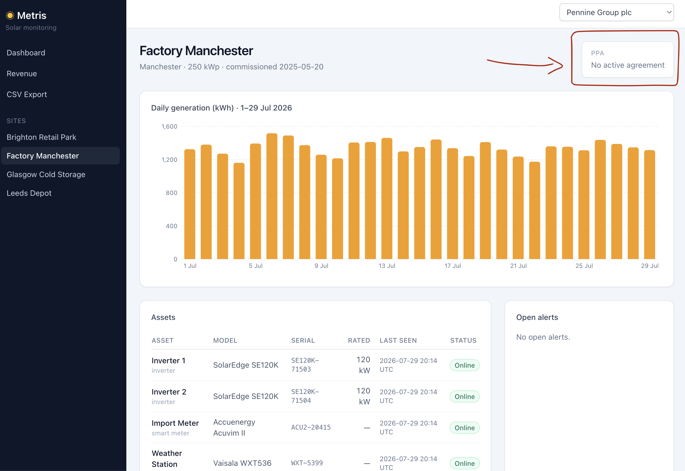

# TICKET-4835 · Revenue showing £0.00 for Factory Manchester

|               |                                                                           |
| ------------- | ------------------------------------------------------------------------- |
| Customer      | Pennine Group plc (reported by Rachel Donnelly)                           |
| Reported      | 2026-07-28 11:20 UTC                                                      |
| Severity      | High — revenue and savings are both wrong, on every surface               |
| Status        | **Diagnosed** · remediation is a data change, blocked on commercial input |
| Root cause in | **Data / process** — a contract renewal that was never recorded           |
| Contributing  | **Code** — a missing PPA rate is silently treated as a rate of zero       |
| Affects       | Factory Manchester only, from 2026-07-01                                  |

---

## Summary

Factory Manchester's PPA expired on **2026-06-30 and was never renewed in the
platform**. With no agreement covering July, there is no rate to apply, so the
platform reports £0.00 revenue.

The same gap inflates savings. `savings = self-consumed × (grid tariff − PPA
rate)`, and with the PPA rate absent the formula uses zero, making the site
look like it saves the full grid price. That is why Rachel saw two things at
once that seemed unrelated: revenue collapsed and savings went _up_.

This is not a calculation bug. The figures are being computed correctly from
inputs that are incomplete. The code's contribution is that it presents the
result of a missing contract as a confident number rather than flagging it.

---

## What the customer saw

Signed in as `energy@penninegroup.co.uk`, Site Overview for
`factory-manchester`, 2026-07-01 → 2026-07-29:

```
status:     active
activePpa:  null                    ← no agreement in force
production: 38,989.25 kWh   (29 of 29 days present, generation normal)
revenue:    £0.00
savings:    £10,916.99
```

All three points in the report reproduce, including the one that looked like a
side note: savings really is higher than it should be, and it is the clearest
symptom of the actual cause.



The console states the cause itself — **PPA: No active agreement** — while
showing £10,916.99 of savings a few pixels away. The same screen rules out the
alternatives: generation runs 1,150–1,500 kWh every day with no gaps, all four
assets report `Online` with a heartbeat at 2026-07-29 20:14 UTC, and there are
no open alerts. Nothing is wrong with the site or its hardware.

Unlike TICKET-4821, this affects **every** surface — Dashboard, Revenue, Site
Overview and the CSV export all show £0.00, because the problem sits upstream
of both query paths.

---

## What actually happened

### The contract expired with no successor

```sql
SELECT s.slug, pa.rate_per_kwh, pa.start_date, pa.end_date, pa.status
FROM ppa_agreements pa JOIN sites s ON s.id = pa.site_id
WHERE s.slug IN ('factory-manchester', 'leeds-depot');
```

```
 factory-manchester | 0.1200 | 2025-07-01 | 2026-06-30 | active       ← expired, no successor
 leeds-depot        | 0.0800 | 2025-09-12 | 2026-06-30 | superseded
 leeds-depot        | 0.0800 | 2026-07-01 | 2031-06-30 | active       ← renewed
```

One row for Manchester, ending **2026-06-30**. July readings fall outside its
window, so the join in `reportingService.js:45` — and the equivalent join in
the `mv_site_daily_kpis` definition — finds no rate at all.

### Leeds Depot expired on the same day and was renewed

```
2026-06-28 09:32:41 | ops@metris.energy | ppa_agreement.created
   leeds-depot/2026-07-01 → {"start_date":"2026-07-01","end_date":"2031-06-30","rate_per_kwh":0.08}
   "Renewal executed 2026-06-28; countersigned copy filed."

2026-06-28 09:33:05 | ops@metris.energy | ppa_agreement.status.updated
   leeds-depot/2025-09-12 → status: active → superseded
   "Superseded by 2026 renewal."
```

There is **no equivalent audit entry for Factory Manchester**. Two Pennine
contracts expired on 2026-06-30; the renewal run two days earlier covered one
of them and missed the other.

Factory Manchester is also the only site in the portfolio whose agreement is
still flagged `status = 'active'` with an end date in the past — so the old
contract was never closed out either.

### Why savings rises when revenue falls

```
revenue = production   × COALESCE(ppa_rate, 0)
savings = self_consumed × (grid_price − COALESCE(ppa_rate, 0))
```

With no agreement, `ppa_rate` becomes `0`:

| Figure  | Reported today | With a renewal at £0.12/kWh | Error          |
| ------- | -------------- | --------------------------- | -------------- |
| Revenue | £0.00          | £4,678.71                   | −£4,678.71     |
| Savings | £10,916.99     | £6,238.28                   | **+£4,678.71** |

Both errors are the same size. At this site self-consumption equals production
— a factory consumes everything it generates — so
`savings error = self_consumed × rate = production × rate = the missing revenue`.

> £0.12/kWh is the **expired** contract's rate, used here only to size the
> impact. The actual renewal terms must come from the commercial team.

### Where these figures live

Revenue and savings are **never stored as data**. No table in the schema has a
revenue or savings column — the only monetary values persisted are the inputs,
`ppa_agreements.rate_per_kwh` and `prices.price_per_kwh`. There is no invoice
table and no monthly close. Every figure the customer sees is computed inside
the `SELECT` that serves the request (`reportingService.js:35`).

The one apparent exception is `mv_site_daily_kpis`, which does hold
`revenue_gbp` and `savings_gbp` on disk — but it is a materialized view
(`relkind = 'm'`), a derived cache that `REFRESH` rebuilds from scratch.

Two consequences follow, and they pull in opposite directions.

**Recording the agreement fixes July retroactively.** Inserting a PPA starting
2026-07-01 reprices the whole month with no backfill and no historical rows to
correct: Revenue, Site Overview and the CSV export are right on the next
request, and the dashboard follows the next rollup refresh (plus up to 60
seconds of cache).

**Nothing records what was displayed.** Because no figure is persisted, there
is no way to reconstruct what Pennine saw on any given day. `api_logs` keeps
the request — path, operation name, status, duration, cache hit or miss — and
never the response body. Once the agreement is recorded, the incorrect figures
are simply gone. If Pennine has already invoiced from them, the amounts have to
come from their side, not from ours.

### Nothing was watching for this

A single query finds it:

```sql
SELECT s.slug, COUNT(DISTINCT p.reading_date) AS days, SUM(p.production_kwh) AS kwh
FROM productions p
JOIN assets a ON a.id = p.asset_id
JOIN sites s ON s.id = a.site_id AND s.status = 'active'
WHERE NOT EXISTS (
  SELECT 1 FROM ppa_agreements pa
  WHERE pa.site_id = s.id AND pa.status = 'active'
    AND p.reading_date BETWEEN pa.start_date AND pa.end_date)
GROUP BY s.slug;
```

```
 factory-manchester | 29 | 38989.25
```

Nothing runs it. The three alert types the platform knows about —
`asset_offline`, `comms_degraded`, `underperformance`
(`packages/shared/src/constants.js:3`) — are all about hardware. There is no
integrity check on **contract** data, which is what actually determines the
invoiced figure.

There is also no routine that expires an agreement when its end date passes,
and the reason is broader than a missing job: **the platform has no write path
for agreements at all.** Every reference to `ppa_agreements` in application
code is a read — the `activePpa` resolver (`site.js:54`), the reporting join
(`reportingService.js:45`) and the rollup definitions. The only `INSERT` lives
in the database seed. The GraphQL schema declares no `type Mutation`, and the
only write routes in the entire API are `POST /auth/login` and
`POST /internal/ingest/readings`.

The PPA lifecycle — create, renew, expire — is therefore carried out entirely
by hand against the database. The Leeds Depot audit entries confirm it:
`actor_type: user`, `actor_id: ops@metris.energy`. That single fact explains
both halves of this incident. Nobody recorded the renewal, and nobody closed
out the old agreement, because no process exists that could have done either.

---

## Impact

- One site, one customer, every day since **2026-07-01**.
- Revenue understated by **£4,678.71** for July; savings overstated by the
  same amount.
- Present on every surface, so there is no screen where the number is right.
- **Invoicing risk:** if Pennine invoices from these figures, July is wrong in
  both directions.
- The gap grows by roughly £161/day of generation until the agreement is
  recorded (£4,678.71 over 29 days).
- No other site is currently affected, and none of the remaining agreements
  expires within the reporting window.
- Because no figure is persisted, **there is no record of what was displayed**
  on any given day. Correcting the agreement removes the evidence of the error
  along with the error.

---

## Immediate remediation

**This is a data fix and it is blocked on a commercial answer.** The platform
cannot invent a rate, and applying the expired one would be a guess about a
contract.

**1 — Confirm with the commercial team** whether the Factory Manchester PPA was
renewed, and on what rate and term. Three possible answers, three different
actions:

| Answer                      | Action                                                                                                                                       |
| --------------------------- | -------------------------------------------------------------------------------------------------------------------------------------------- |
| Renewed, just never entered | Record the agreement (step 2). July figures become correct retroactively                                                                     |
| Still under negotiation     | Site is genuinely unpriced. Tell Pennine that £0.00 is accurate for now, and suppress the savings figure rather than showing an inflated one |
| Not renewing                | Same as above, plus the site's reporting needs a decision                                                                                    |

**2 — Once confirmed, record it the same way Leeds Depot was.** Values in
angle brackets come from the commercial answer.

> ⚠️ **The `UPDATE ... superseded` is not optional, and it is the dangerous
> half of this operation.** Nothing in the schema prevents two `active`
> agreements from covering the same day for the same site, and the reporting
> join matches _both_, emitting a duplicate row per day. Demonstrated inside a
> rolled-back transaction:
>
> ```
> -- two active agreements overlapping on 2026-06-15
>  day        | rows emitted | rates
>  2026-06-15 |            2 | 0.1200 + 0.1200
>
> -- 1,000 kWh at £0.12 then totals:
>  £240.00     (should be £120.00)
> ```
>
> Revenue silently doubles on every surface. Insert and supersede in the same
> transaction, and verify the day count afterwards.

```sql
BEGIN;

INSERT INTO ppa_agreements
  (site_id, counterparty, rate_per_kwh, currency, start_date, end_date, status)
SELECT id, 'Pennine Group plc', <rate>, 'GBP', '2026-07-01', '<end_date>', 'active'
FROM sites WHERE slug = 'factory-manchester';

UPDATE ppa_agreements SET status = 'superseded'
WHERE site_id = (SELECT id FROM sites WHERE slug = 'factory-manchester')
  AND end_date = '2026-06-30';

COMMIT;
```

An `audit_logs` entry should accompany both statements, mirroring the Leeds
renewal, so the correction is traceable — it is the only trace this correction
will leave.

Verify no day is covered twice before committing:

```sql
SELECT p.reading_date, COUNT(*) AS matching_agreements
FROM productions p
JOIN assets a ON a.id = p.asset_id
JOIN sites s ON s.id = a.site_id AND s.slug = 'factory-manchester'
JOIN ppa_agreements pa ON pa.site_id = s.id AND pa.status = 'active'
  AND p.reading_date BETWEEN pa.start_date AND pa.end_date
GROUP BY 1 HAVING COUNT(*) > 1;
-- must return zero rows
```

**3 — Refresh the rollup** so the dashboard follows:

```sql
REFRESH MATERIALIZED VIEW CONCURRENTLY mv_site_daily_kpis;
```

**4 — Verify** that `site(slug: "factory-manchester") { activePpa }` returns
the agreement and that revenue is no longer £0.00 for July.

---

## Preventing recurrence

| Priority  | Action                                                                                                                                                                                                                                                                                                                                                                                                                                                                                         |
| --------- | ---------------------------------------------------------------------------------------------------------------------------------------------------------------------------------------------------------------------------------------------------------------------------------------------------------------------------------------------------------------------------------------------------------------------------------------------------------------------------------------------- |
| **P1**    | Run the detection query above as a scheduled data-quality check and raise an alert. An active site generating with no covering agreement is always a defect — it would have caught this on 1 July instead of on day 28.                                                                                                                                                                                                                                                                        |
| **P1**    | Stop coalescing a missing PPA rate to zero in `reportingService.siteDailyKpis` and in the `mv_site_daily_kpis` definition. "No contract" and "a contract at £0.00" are different states and must not render identically. Surfacing them as unavailable is more work than a patch — it touches the non-null GraphQL fields and the console — but the current behaviour publishes a _better-looking_ savings number when data is missing, which is the failure mode least likely to be reported. |
| **P1**    | Add an exclusion constraint so two `active` agreements cannot overlap for the same site. Today nothing stops it, and the consequence is doubled revenue rather than an error — a worse outcome than the bug being reported here. The database can enforce this; a manual process cannot.                                                                                                                                                                                                       |
| **P2**    | Warn on agreements approaching expiry. Leeds Depot was renewed with two days to spare; the same process missed Manchester entirely. A 60-day notice would have surfaced both.                                                                                                                                                                                                                                                                                                                  |
| **P2**    | Reconcile `status` with the date window, or drop the column. It duplicates information the dates already carry and has drifted — Manchester's expired agreement is still marked `active`, so the field cannot be trusted on its own.                                                                                                                                                                                                                                                           |
| **P2**    | Give agreements a write path. Renewals are executed by hand against the database because the API offers no mutation and the console offers no screen. Every future renewal carries the same risk of being forgotten or applied incompletely.                                                                                                                                                                                                                                                   |
| **P3** ✅ | **Done.** Show the applicable rate next to revenue on Site Overview. Rachel could then have seen "no agreement" instead of inferring it from a £0.00. Also applied to the dashboard site table, where the same £0.00 appears.                                                                                                                                                                                                                                                                  |

Apart from the P3 display change, no code change is included with this report:
the customer-facing defect is a missing record, and shipping a guess about a
contract would be worse than the bug. The remaining hardening items are the
second pass.

---

## What to tell the customer

> Hi Rachel,
>
> Thanks for flagging this, and for mentioning the savings figure — that
> detail is what pointed us straight at the cause.
>
> Factory Manchester's power purchase agreement ran to **30 June 2026**, and a
> renewal has not been recorded on the platform. With no agreement in force
> there is no rate to apply to July's generation, so revenue calculates as
> £0.00. The same gap is why savings looks high: that figure is the difference
> between your grid tariff and your PPA rate, and with no PPA rate on file it
> is showing the full grid price instead.
>
> Your generation data is completely unaffected — the site produced
> 38,989.25 kWh in July and every day's reading is present. This is only about
> the pricing applied on top of it.
>
> We are confirming the renewal terms with our commercial team. As soon as the
> agreement is recorded, July's revenue and savings will recalculate correctly
> across the dashboard, the revenue page and the export — no data is lost. We
> will come back to you with a date.
>
> Please hold off invoicing Manchester for July until then; both figures are
> currently wrong, revenue understated and savings overstated. If anything has
> already been raised against the Manchester figures, let us know the amounts —
> our system recalculates these values live rather than storing them, so once
> the agreement is recorded we will no longer be able to see what was shown
> previously.
>
> Your other sites are unaffected — Leeds Depot's agreement expired on the same
> date and its renewal was recorded correctly.

---

## Appendix — reproduction

```bash
TOKEN=$(curl -s -X POST localhost:4000/auth/login \
  -H 'Content-Type: application/json' \
  -d '{"email":"energy@penninegroup.co.uk","password":"SolarDemo!2026"}' | jq -r .token)

curl -s localhost:4000/graphql -H "Authorization: Bearer $TOKEN" \
  -H 'Content-Type: application/json' \
  -d '{"query":"{ site(slug:\"factory-manchester\") { activePpa { ratePerKwh endDate } dailyKpis { day productionKwh revenueGbp savingsGbp } } }"}'
```

`activePpa` returns `null`; every day in `dailyKpis` returns
`revenueGbp: 0` with a non-zero `productionKwh`.
